#  2021.3.9

### 改进点：

1. 原始SRNet不稳定，让鉴别器训练领先于生成器，每次迭代都训练鉴别器，每偶数次迭代训练生成器
2. 控制鉴别器参数处于合适范围，避免鉴别器损失快速降低以至于无法进行对抗训练
3. 文本转换模块，sk部分有错误

### 不同之处
1. 该作者所用字体文件只有两个，然后合成数据，仍然获得了较好的结果
2. 模型构建，其中padding不一样，鉴别器最后一层没有使用Sigmoid函数
3. 部分损失函数书写不同

### 目前进展
1. 运行开源Pytorch代码，需要180k-200k次迭代
2. 修改自己代码，正在运行
3. 基线模型

### 工作

1. 搭建UI，实现基本功能

# 3.10和3.11
### 工作
1. 改造自己代码，与开源代码仔细比对，并同时进行三个版本运行
	a. 鉴别器最后一层没有Sigmoid，有对鉴别器参数的限制clip

	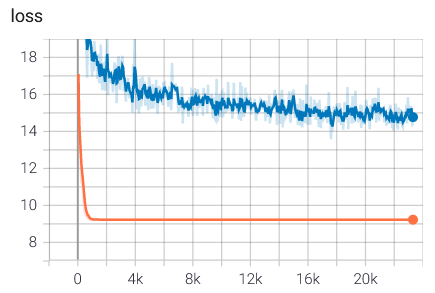
	
	b. 有Sigmoid和clip
	
	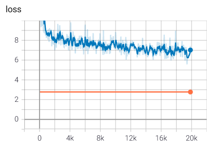
	
	c. 有Sigmoid，无clip
	
	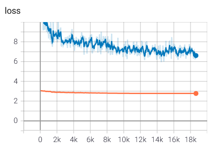
	
2. 分析
	
	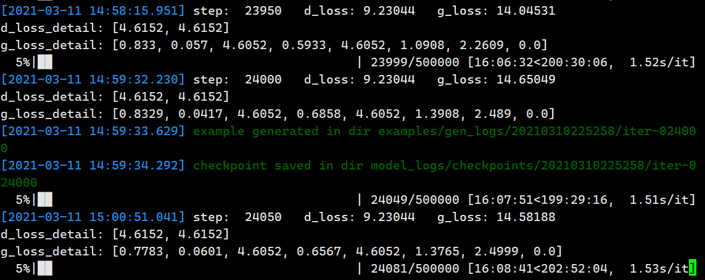
	
	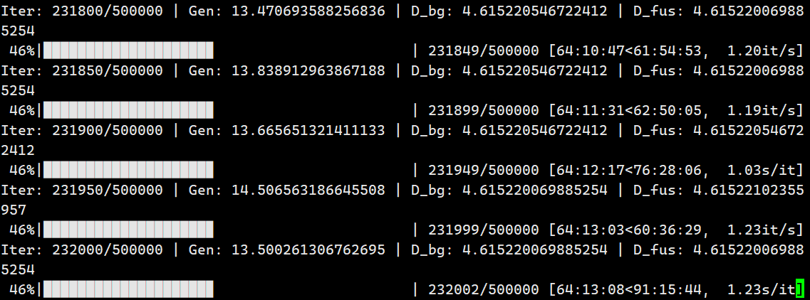
	
	鉴别器损失都降到了[4.6152, 4.6152]，之后停滞不动，**生成器还可以继续改善**，开源pytorch代码大约在60k左右出现文字替换现象：
	
	
	
	
	
	在213k时：
	
	
	
	
	
	但背景修补之后的图像中有黑点，影响了结果图像质量。
	
	**pytorch eval()在评测时需要开启eval，否则就会有上述局面！**
	
	
	
	
	
2. 完善UI，调用youdao-ai的tensorflow模型，缺点：加载模型参数很慢

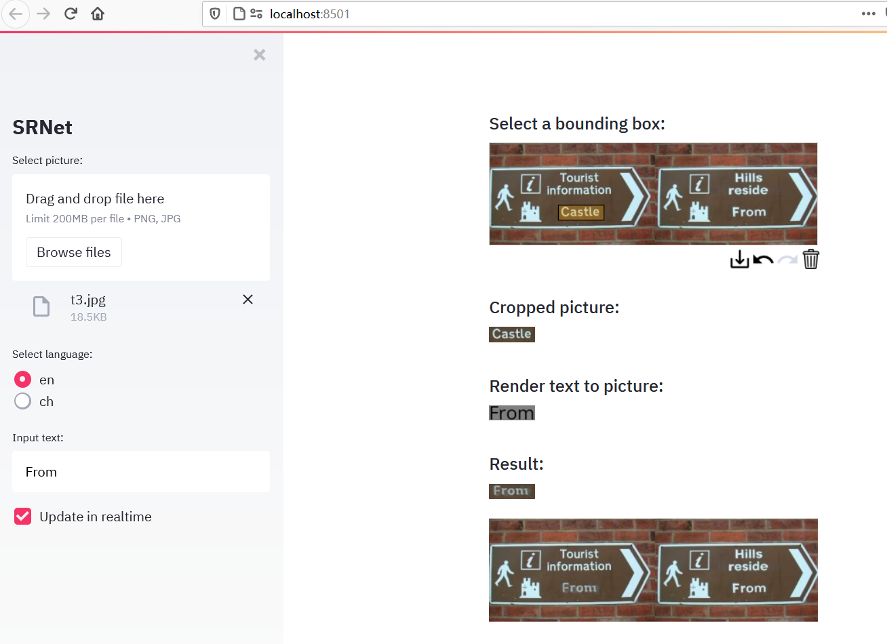

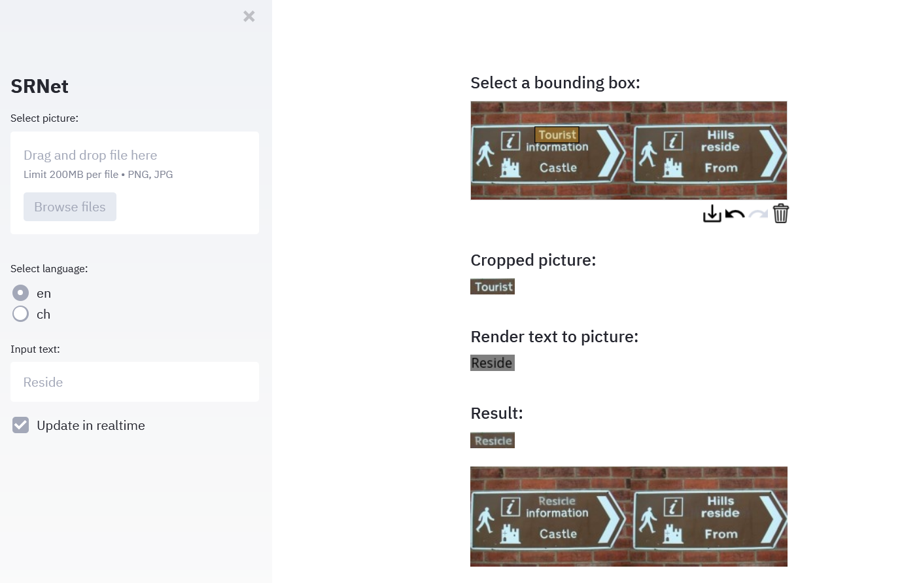

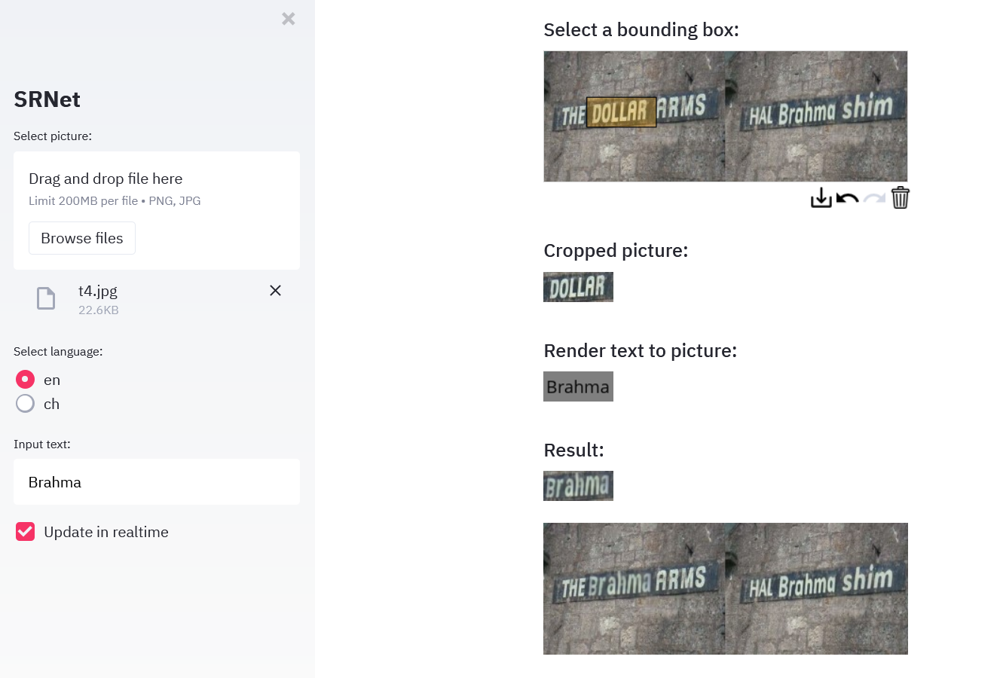

# 3.12

1. 更新UI模块，换用自己训练的Pytorch模型，提升了运行速度，但由于迭代次数不够，效果较差。

   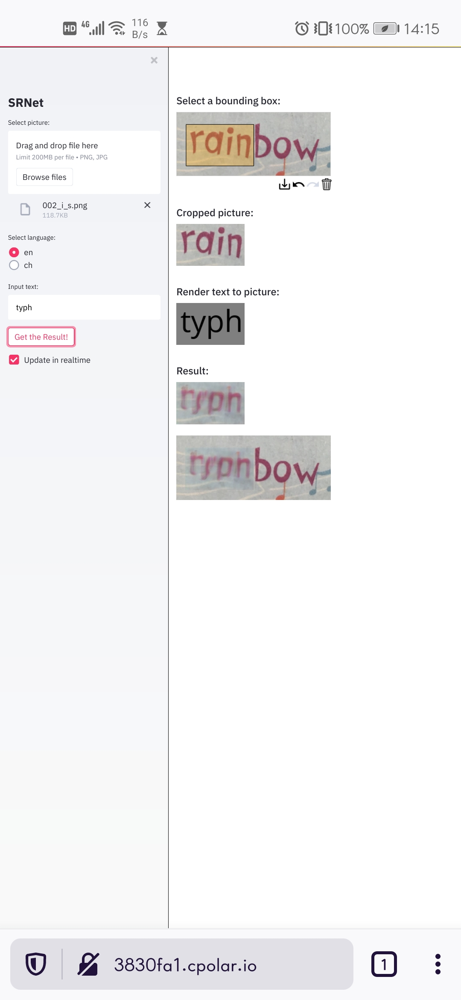

2. 优化代码，通过设置DataLoader中的`pin_memory`和`num_works`提升数据读取速率，消除数据读取瓶颈。

# 3.13 

1. 对GAN训练过程优化：先训练鉴别器，再训练生成器

   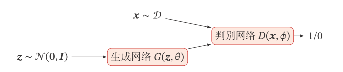

	- 鉴别器训练阶段，噪声从G输入，输出fake data，然后**detach**之后，随着true data一起进入D，这样在D_loss反向传播梯度时，梯度流会被截断，避免影响G中梯度
	- 生成器训练阶段，把**没有detach**的fake data输入D，这样对G_loss反向传播时，可以更新G的梯度

2. GAN的目标函数：
      $$
      \mathop {\min }\limits_G \mathop {\max }\limits_D V(D,G) = {\rm E}_{x\sim{p_{data}(x)}}[\log D(x)] + {\rm E}_{z\sim{p_z}(z)}[\log (1 - D(G(z)))]
      $$

      第一部分：判别器的优化通过$\mathop {\max}\limits_D V(D,G)$实现，$V(D,G)$为判别器的目标函数

      第二部分：生成器的优化通过$\mathop {\min }\limits_G({\mathop {\max }\limits_D V(D,G)})$来实现

      总结：

      - 判别器的目标是最小化交叉熵损失判别器目标函数的最大值代表的是真实数据分布与生成数据分布的JS散度，JS散度可以度量分布的相似性，两个分布越接近，JS散度越小。**生成器的目标是最小化生成数据分布和真实数据分布的JS散度**。

3. GAN Loss

	- **作为一个训练良好的GAN，其Loss就是降不下去的**。衡量GAN是否训练好了，只能由人肉眼去看生成的图片质量是否好。无论是判别器，还是生成器。loss的高低不能代表生成器的好坏。一个好的GAN网络，其GAN Loss往往是不断波动的。

4. GAN训练容易崩溃

      - 当两个分布没有重叠或者重叠非常少时，它们之间的 KL 散度为 +∞，JS 散度为 log 2，并不随着两个分布之间的距离而变化．

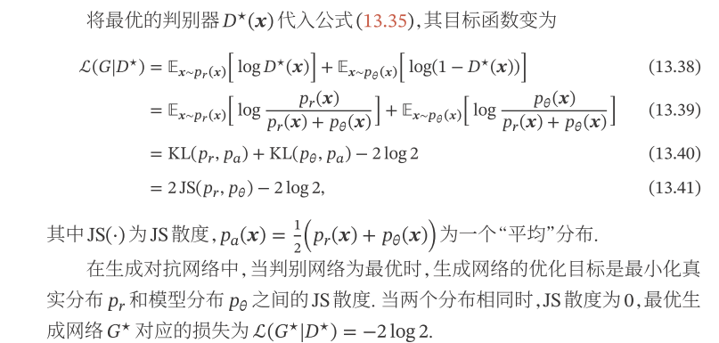

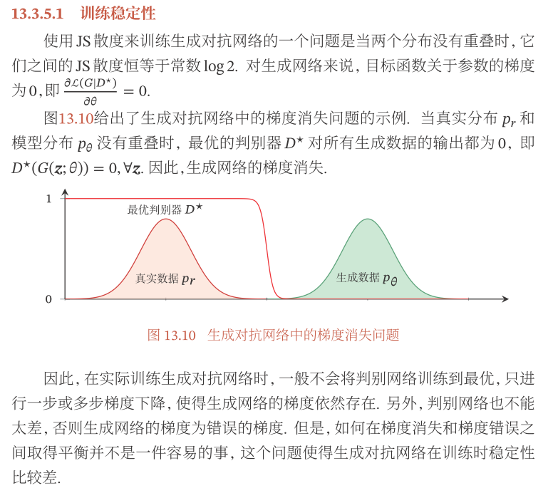

​	
5. 模型崩塌

   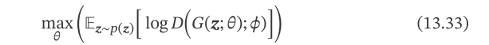

   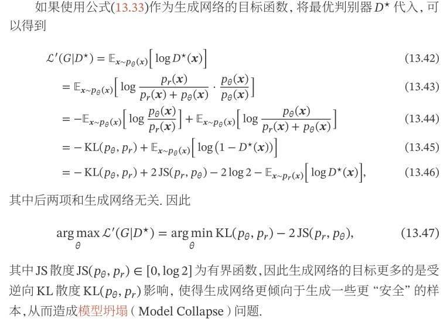

6. WGAN作者提出了使用Wasserstein距离，

   - 解决了原始 GAN 训练不稳定的问题
   - 在一定程度上缓解了模型坍塌问题，使得生成的样本具有多样性。
   
   Wasserstein距离定义如下:
	$$
L={\rm E}_{x\sim{p_{data}}(x)}[f_w(x)] - {\rm E}_{x\sim{p_g}(x)}[f_w(x)]
   $$
通过最小化Wasserstein距离，得到了WGAN的Loss：
   
- WGAN生成器Loss：$- {\rm E}_{x\sim{p_g}(x)}[f_w(x)]$
  
- WGAN判别器Loss：$L=-{\rm E}_{x\sim{p_{data}}(x)}[f_w(x)] + {\rm E}_{x\sim{p_g}(x)}[f_w(x)]$
  
    从公式上GAN似乎总是让人摸不着头脑，在代码实现上来说，其实就以下几点：
   
     - **判别器最后一层去掉sigmoid**
     - **生成器和判别器的loss不取log**
     - **每次更新判别器的参数之后把它们的绝对值截断到不超过一个固定常数c**

# 3.14

1. 开源Pytorch代码，500k个迭代完成，耗时5.6天，平均每个迭代耗时0.97s.

   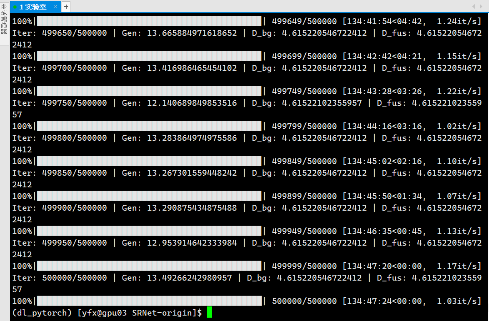

- 500k次迭代的结果：

  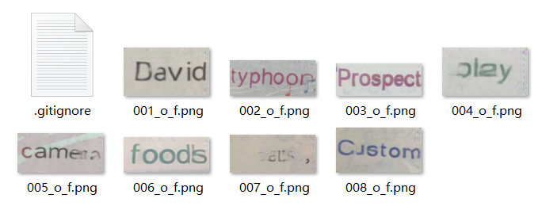

- 490k次迭代结果：

  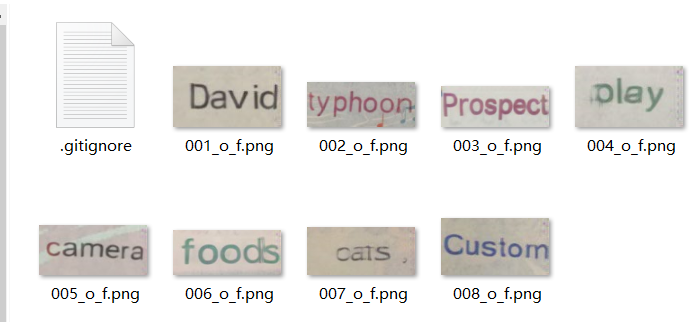

- 401k次迭代结果：

  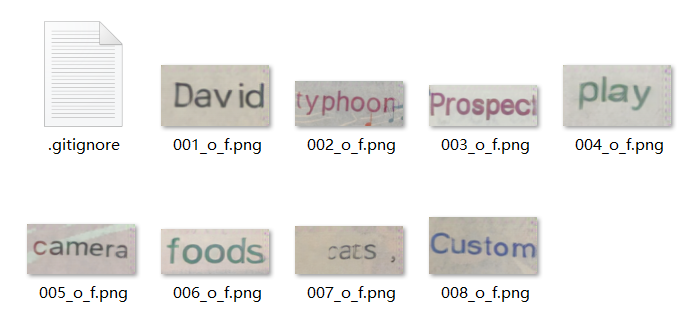
2. 调整`Dataloader`中的`num_works`为16，可以获得0.66s/it的速度，预计3.8天左右可以完成500k个迭代。

3. 由于未使用2中优化，我的代码面临数据读取瓶颈，速度很慢，故在165k次迭代时停止：

   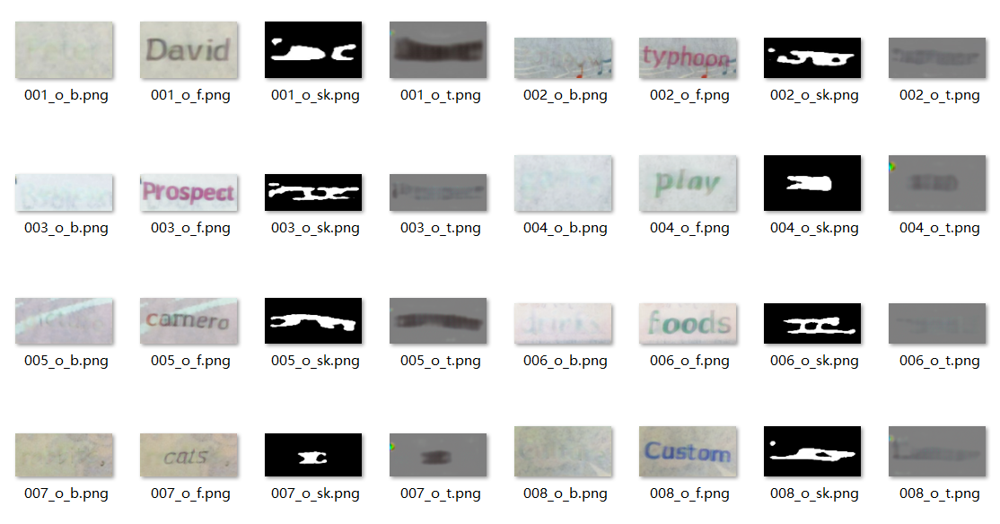

# 3.15

1. 未使用WGAN优化：

   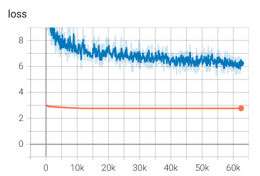

   第62k次迭代后的结果：

   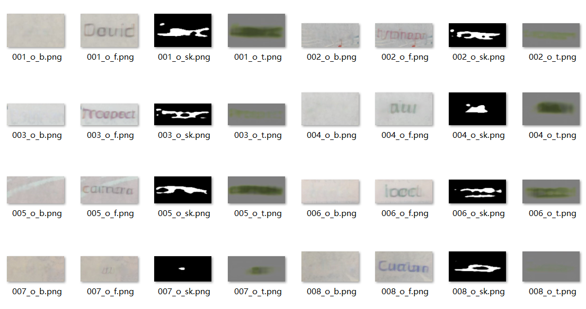

2. 使用WGAN优化：

   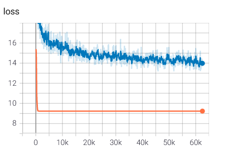

   第62k次迭代后的结果：

   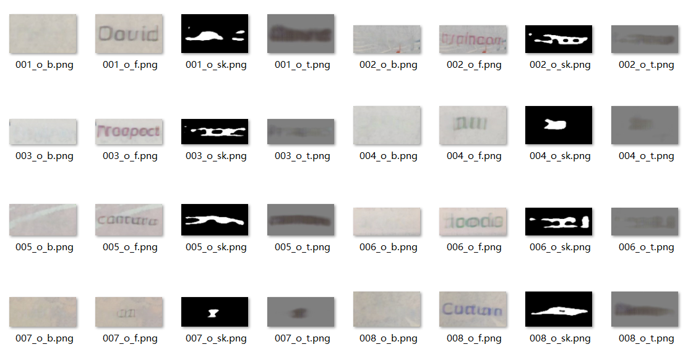